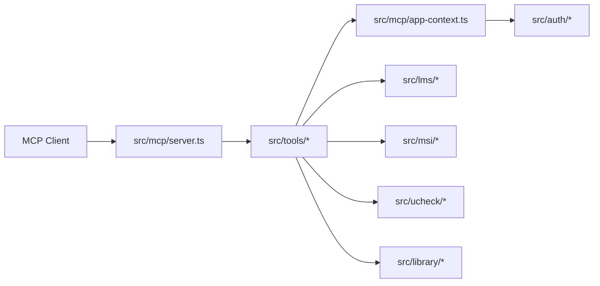

# Architecture

이 문서는 저장소의 현재 구조와 서비스별 구현 패턴을 설명합니다.

## 1. 전체 구조

핵심 아이디어는 다음과 같습니다.

- MCP 진입점은 하나
- 서비스별 클라이언트와 파서는 분리
- tool 계층은 입력 검증, 응답 포맷, 세션 컨텍스트 관리 담당
- 실제 HTML/JSON 해석은 서비스 계층으로 내림

## 2. 디렉터리 역할

### `src/mcp`

- MCP 서버 생성
- stdio transport 연결
- 앱 컨텍스트 생성
- 세션별 강의 컨텍스트와 승인 토큰 저장

### `src/auth`

- 저장 로그인 프로필 관리
- Windows Credential Manager 연동
- 앱 데이터 경로 관리

### `src/lms`

- LMS SSO 로그인
- 세션 저장/재사용
- 강의실 진입
- 공지 / 과제 / 자료 / 온라인 파싱
- 첨부 다운로드
- 과제 제출 / 수정 / 삭제

### `src/msi`

- MSI 로그인 브리지 체인
- 메뉴 오프너
- 시간표 / 성적 / 졸업요건 파서

### `src/ucheck`

- UCheck SSO 로그인
- UCheck 계정 정보 조회
- 강의 목록 조회
- 출석현황 서비스

### `src/library`

- 도서관 토큰 로그인
- 도서관 세션 저장/재사용
- 스터디룸 목록 / 상세 조회
- 스터디룸 예약 / 수정 / 취소
- 동행자 이름+학번 -> 내부 patron id 해석

### `src/tools`

- MCP tool 등록
- 입력 스키마 정의
- text/structuredContent 응답 포맷
- 강의 식별 UX
- 쓰기 승인 흐름

## 3. 인증 구조

### LMS

- 명지대 SSO entry URL 직접 사용
- 로그인 성공 후 LMS 메인 페이지 확인
- 세션 파일 저장

### MSI

- LMS보다 한 단계 더 복잡한 브리지 체인 사용
- MSI 전용 세션 파일 분리

### UCheck

- LMS와 같은 SSO 암호화 로직 재사용
- UCheck 메인 진입 URL 사용
- UCheck 전용 세션 파일 분리

### Library

- 같은 계정 자격증명을 재사용하지만 LMS식 SSO 폼 암호화는 쓰지 않음
- `POST /pyxis-api/api/login` 으로 access token 발급
- `Pyxis-Auth-Token` 헤더 기반 JSON API 호출
- 도서관 전용 세션 파일 분리

## 4. 앱 컨텍스트

[`src/mcp/app-context.ts`](../src/mcp/app-context.ts) 는 현재 런타임의 공통 상태를 갖고 있습니다.

핵심 책임:

- LMS / MSI / UCheck client 생성
- Library client 생성
- 저장 로그인 자격증명 해석
- 세션별 마지막 강의 컨텍스트 저장
- 쓰기 tool 승인 토큰 발급 / 검증

## 5. LMS 강의 식별 계층

[`src/tools/course-resolver.ts`](../src/tools/course-resolver.ts) 는 LMS tool 전반의 강의 식별 UX를 담당합니다.

지원 기능:

- `course` / `kjkey` 통합 입력
- 최신 학기 우선 해석
- 전체 학기 fallback
- 세션 컨텍스트 기본값

이 계층 덕분에 공지/과제/자료/온라인 tool이 같은 강의 입력 UX를 공유합니다.

## 6. 쓰기 승인 계층

LMS 쓰기 tool은 실제 상태 변경 전에 승인 토큰을 요구합니다.

흐름:

1. 사용자가 `confirm=true` 로 호출
2. 서버가 입력 fingerprint 생성
3. `approvalToken` 발급
4. 같은 세션에서 다시 호출
5. fingerprint 일치 시에만 실행

이 구조는 오작동이나 프롬프트 실수를 줄이기 위한 안전장치입니다.

## 7. 서비스 추가 패턴

새 서비스를 붙일 때 현재 저장소는 대체로 같은 패턴을 따릅니다.

1. `src/<service>/config.ts`
2. `src/<service>/constants.ts`
3. `src/<service>/client.ts`
4. `src/<service>/types.ts`
5. `src/<service>/services.ts`
6. `src/tools/<service>.ts`
7. `src/mcp/app-context.ts` 연결
8. `src/tools/index.ts` 등록

## 8. 새 tool 추가 패턴

새 tool 을 추가할 때는 보통 아래 순서가 자연스럽습니다.

1. 서비스 계층에서 순수 로직 구현
2. 타입 정의
3. MCP tool 입력/출력 스키마 추가
4. text 응답과 structuredContent 응답 설계
5. 실데이터 검증
6. 문서 반영

## 9. 현재 구조의 장점

- 서비스별 로그인/세션이 섞이지 않음
- MCP 노출 계층과 파서 계층이 분리됨
- 실데이터 검증 후 tool 단위로 확장 가능
- read-only 와 write tool 안전정책을 구분하기 쉬움

## 10. 현재 구조의 한계

- HTML 파싱 의존성이 큰 서비스는 화면 변경에 취약함
- 실데이터 검증 없이 추론만으로 기능을 늘리기 어려움
- 집약형 tool 은 내부적으로 여러 호출을 순차 수행하므로 응답 시간이 길어질 수 있음
